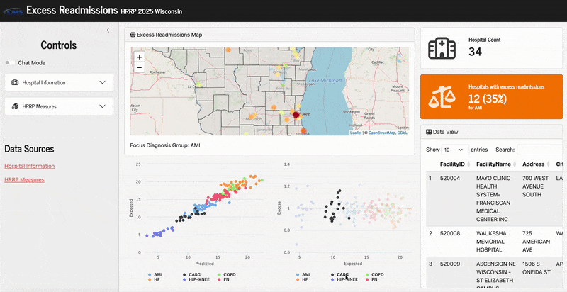

_In progress_

# 1. Building the Structure

# 2. Strengthening the Logic

_For more details on the technical backend for how this was built, you can read [this blog post](https://www.zajichekstats.com/post/building-an-llm-powered-shiny-app-for-hospital-readmissions/) or watch the video below._

