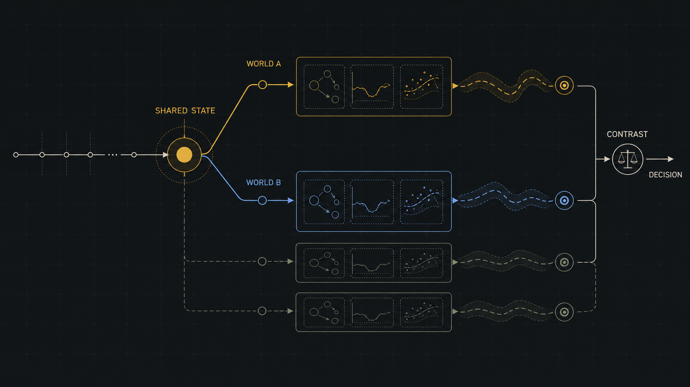

::: {.project-hero}

Project notebook · Exploring

# Flux Estimand Framework

A decision-first methodology for specifying the counterfactual comparison a simulation should estimate before deciding how much of the surrounding system to model.

  <a class="lab-button lab-button-primary" href="https://github.com/zajichek/flux-estimand">View the framework</a>
  <a class="lab-button lab-button-secondary" href="mailto:alex@centralstatz.com?subject=Flux%20Estimand%20methodological%20feedback">Share methodological feedback</a>

:::

::: {.project-notebook}

::: {.notebook-preview}

{fig-alt="Concept diagram showing a shared conditioning state branching into counterfactual worlds, modular simulations, and a decision-oriented contrast"}

Generated concept diagram · not an implemented simulation interface

:::

::: {.notebook-grid}

::: {.notebook-main}

## Why this exists

Simulation projects often begin with a domain-sized ambition: simulate the system. That framing has no natural stopping point because more entities, mechanisms, and interactions can always be added in the name of realism.

Flux Estimand begins with a narrower question: **What decision is being evaluated, and which counterfactual worlds need to be compared?** The goal is to make the scientific and decision target explicit before implementation choices begin to define the project.

## Current hypothesis

An explicit estimand can anchor a simulation around its decision, conditioning state, alternative actions or policies, outcomes, contrasts, and assumptions. A model can then be judged by whether it is sufficient for that comparison—not by whether it reproduces an entire domain.

## How the framework works

1. Identify the decision and the moment at which it is made.
2. Define the shared conditioning state from which counterfactual worlds diverge.
3. Specify the alternative actions or policies.
4. Define target quantities, contrasts, assumptions, and validation needs.
5. Build the simplest `ModelBundle` capable of estimating those quantities credibly.
6. Add fidelity only when it materially improves the target comparison.

## Estimands and ModelBundles

The estimand is the stable decision specification. A Flux `ModelBundle` is one executable implementation of it. Multiple bundles may target the same estimand while using different assumptions, state representations, fidelity levels, or computational strategies.

That separation allows the decision question to remain fixed while implementations evolve or are compared.

## Relationship to Flux

Flux Estimand is owned by Alex Zajichek and is being developed as a methodological layer for decision-oriented applications of [Flux](https://github.com/jarrod-dalton/flux). Flux remains a separate simulation ecosystem maintained in its own repository; Flux Estimand does not replace or claim ownership of it.

:::

::: {.notebook-aside}

### Project state

**Status**  
Exploring

**Stage**  
Concept

**Current artifact**  
Methodology, documentation, agent guidance, and a reusable downstream project template.

**Known limitations**  
No completed estimand, executable ModelBundle, empirical validation, downstream adoption, or demonstrated decision benefit is established by this repository.

**Next experiment**  
Apply the framework to a concrete decision problem and evaluate the resulting specification.

**Useful participation**  
Methodological feedback from simulation modelers and causal-inference practitioners.

:::

:::

## What currently exists

The public repository contains conceptual documentation, guidance for creating and reviewing estimands, and a copyable project structure centered on an authoritative `ESTIMAND.md`. It is a framework repository—not itself an estimand project—and therefore does not contain a root estimand or executable simulation bundle.

## Current limitations

Flux Estimand is experimental methodology. Simulation can make alternative worlds executable under stated assumptions, but it does not establish that those assumptions are correct, that a state representation is sufficient, or that the resulting comparison is valid. The framework complements causal-inference thinking; it is not a substitute for established study-design and estimation methods.

## Next experiment

The next useful test is a concrete downstream decision problem. That application can reveal whether the template clarifies the target comparison, prevents unnecessary model scope, separates scientific assumptions from implementation choices, and produces validation requirements that can actually be evaluated.

## Participate

Methodological critique is welcome—especially around conditioning states, counterfactual definitions, model sufficiency, validation targets, and the boundary between estimands and their implementations.

- [Review Flux Estimand on GitHub](https://github.com/zajichek/flux-estimand)
- [Share methodological feedback](mailto:alex@centralstatz.com?subject=Flux%20Estimand%20methodological%20feedback)

:::
