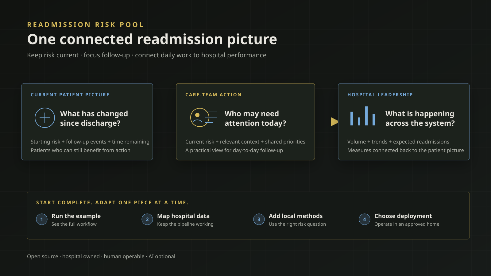

::: {.project-hero}

Open-source hospital readmission management · Active development

# Readmission Risk Pool Platform

A practical starting point for keeping risk current after discharge, helping care teams focus follow-up, and connecting individual patient work to the hospital's larger readmission picture.

  <a class="lab-button lab-button-primary" href="https://github.com/centralstatz/readmission-risk-pool-hospital-implementation">Explore the Hospital Implementation</a>
  <a class="lab-button lab-button-secondary" href="https://github.com/centralstatz/readmission-risk-pool-platform">View the Platform source</a>

:::

::: {.project-notebook}

::: {.notebook-preview}

{fig-alt="Diagram connecting a current patient picture to care-team action and hospital leadership insight, followed by four incremental implementation steps"}

Project-direction diagram · explanatory concept, not a clinical interface

:::

::: {.notebook-grid}

::: {.notebook-main}

## The problem this is trying to solve

This is a problem I have been thinking about for several years. Hospitals may have a readmission score when a patient leaves, but that score quickly becomes stale. Care teams then struggle to assemble what has happened after discharge, while quality and executive leaders often see a separate, delayed set of aggregate measures.

Those are not three independent problems. They are different views of the same work.

The **readmission risk pool** is the group of recently discharged patients who have not yet been readmitted and can still benefit from follow-up. Managing that pool well means knowing who is in it now, what has changed, where attention may be most useful, and how the collective picture affects hospital performance.

The idea began as a proposed way to connect patient-level follow-up with a hospital-wide view. [Read the original 2024 article](https://www.zajichekstats.com/post/managing-the-readmission-risk-pool/).

## One connected working picture

The platform is meant to support a shared readmission “command center” without forcing every audience into the same screen or level of detail.

- **Care teams** need a current view of which patients remain at risk, what has happened since discharge, and who may need attention today.
- **Hospital analysts and modelers** need room to use local data, existing discharge scores, and methods that reflect the hospital's population and reasons for readmission.
- **Quality and executive leaders** need the individual patient picture to roll into trustworthy measures of volume, trends, expected readmissions, and operational impact.

The practical value is the connection between those views. A patient-level risk update should not live in a standalone model, and an executive metric should not be detached from the day-to-day work that produced it.

:::

::: {.notebook-aside}

### Project state

**What it is**  
A free, open-source starting point for a hospital-owned readmission management system.

**Available now**  
Public v0.1.0 Platform and Hospital Implementation releases, a complete fictional example, a working web application, documented human operations, and a validated Posit Connect Cloud repository generator.

**Stage**  
Validation of the software, replacement points, and implementation path—not clinical validation.

**Not yet established**  
Clinical performance, production approval, turnkey connection to a hospital's data, or a supported container deployment.

**Next experiment**  
A container-based path for hospital-controlled deployment.

**Useful participation**  
Feedback on the care-management, quality, analytical, and leadership decisions the product should support.

:::

:::

## Start with something that already works

The [Readmission Risk Pool Hospital Implementation](https://github.com/centralstatz/readmission-risk-pool-hospital-implementation) is the repository a hospital installs and customizes. It is not itself a fictional project. It includes fictional data and examples so a team can run and inspect a complete working path—from source data through risk updates and history to a web application—before asking for internal approval or connecting sensitive hospital data.

That makes the early conversation concrete. A developer or analyst can evaluate the workflow, see what the app provides, and identify what the hospital would need to change without starting from a blank repository or committing to a predefined vendor tool.

## Adopt it one piece at a time

The platform is intentionally designed for incremental implementation. A hospital can keep a working reference path while replacing one locally owned piece at a time.

1. **Run the complete example.** Install the Hospital Implementation and exercise the fictional source-to-application workflow.
2. **Choose the deployment path.** The platform can currently generate and validate a repository prepared for Posit Connect Cloud setup. A supported container target is a planned next step for deployment inside hospital-controlled infrastructure.
3. **Connect hospital data.** Write the local SQL or other extraction and mapping logic needed to populate the shared canonical model. Once that mapping passes validation, the rest of the pipeline is designed to continue working unchanged.
4. **Make the risk method local.** Begin with an existing discharge score if useful, then update risk throughout follow-up using the hospital's own data and modeling approach. Use a built-in estimand—the precise quantity a model is asked to estimate—or register another quantity that better matches the hospital's decisions.

The same principle extends to storage, analytical products, and the application: adopt the reference first, then replace a component when there is a concrete reason to do so.

## Current risk, not only discharge risk

The methodological idea is straightforward: risk should reflect what is known **now**, not only what was known when the patient left the hospital.

A hospital can retain its existing discharge risk score as a useful starting point. During follow-up, its own models can incorporate information such as completed visits, medication access, transportation, or other locally meaningful events. Because different hospitals and patient populations may have different drivers of readmission, the platform does not prescribe one universal model.

It does insist on clarity about what the model predicts. For example, a care team may need the probability that a patient who has not yet returned will be readmitted during the remaining follow-up window—not a generic score whose meaning changes from one implementation to another. That statistical discipline is built into the workflow while leaving the modeling method under hospital control.

## Rigor in the background

There is substantial engineering beneath the working example, but a hospital should not need to understand every internal detail to evaluate or operate it.

- Validation is built throughout the workflow so incompatible data or configuration can fail early and visibly instead of silently producing a misleading result.
- The normal operator journey is documented through a small set of top-level commands for setup, readiness checks, platform runs, history, product refreshes, application checks, and deployment-artifact generation.
- AI and agent workflows are optional conveniences. Every supported operation has a documented human path, and an agent can only invoke the same predefined operations a person can run directly.

The backend documentation remains available for teams that need to review the statistical definitions, validation behavior, history, or replacement boundaries in depth.

## Open source and hospital owned

The Platform and Hospital Implementation are released under the Apache-2.0 license. There is no proprietary platform license required to use, inspect, or adapt the software; a hospital still bears its own implementation, infrastructure, security, and operating costs.

The hospital owns its data connections, model choices, infrastructure, workflows, and local modifications. CentralStatz provides an inspectable foundation rather than a closed tool that dictates how readmission risk must be modeled everywhere.

## Where it stands today

The current release demonstrates a complete, runnable implementation using synthetic data and an intentionally nonclinical reference risk method. It includes durable risk history, analytical products, a web application, strong validation, and generation of deployable application artifacts.

It is not yet a clinically validated or production-approved hospital system. Real use requires local source mapping, development and validation of an appropriate risk method, approved infrastructure, privacy and security controls, workflow design, monitoring, and clinical governance. Posit Connect Cloud preparation is implemented; a supported container target and turnkey inside-the-firewall deployment are not.

## Participate

The most useful feedback now is practical: what questions should care managers be able to answer each morning, what context do analysts need to trust a changing risk estimate, and which connected measures help quality and executive leaders act rather than merely review performance after the fact?

- [Install or review the Hospital Implementation](https://github.com/centralstatz/readmission-risk-pool-hospital-implementation)
- [Review the underlying Platform](https://github.com/centralstatz/readmission-risk-pool-platform)
- [Read the original practical framework](https://www.zajichekstats.com/post/managing-the-readmission-risk-pool/)
- [Discuss the project](mailto:alex@centralstatz.com?subject=Readmission%20Risk%20Pool%20Platform)

:::
