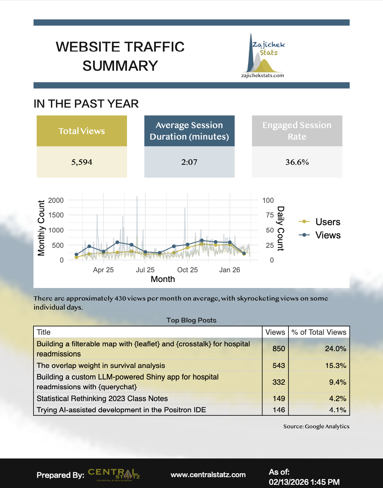

::: {.project-hero}

Project notebook · Exploring

# On-Demand Analytics Report

An early exploration of turning a recurring Google Analytics report into a reproducible, branded workflow.

:::

::: {.project-notebook}

{.detail-preview}

## Why this exists

Recurring reports often accumulate manual steps, hidden decisions, and formatting work. This project explores a more explicit system: defined inputs, repeatable transformations, a consistent artifact, and clear places for analyst review.

## Current state

An initial report-generation workflow and visual artifact exist. The repository does not yet contain enough evidence to describe operational use, validation, or deployment, so those details remain intentionally provisional.

## Current hypothesis

A parameterized, on-demand workflow can reduce repetitive assembly and improve consistency, while leaving interpretation and quality review with the analyst.

## Next experiment

Document the inputs, review gates, and the boundary between automated output and analyst interpretation.

## Participate

If your team maintains a recurring report that is difficult to reproduce or update, [share the workflow](mailto:alex@centralstatz.com?subject=On-Demand%20Analytics%20Report).

:::
